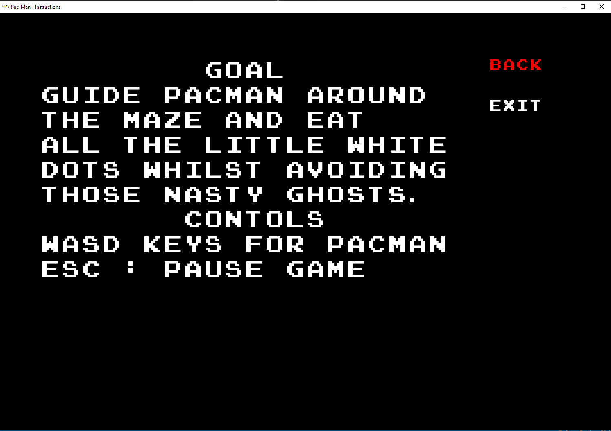

# Pac-Man

This is Pac-Man game made in **C++** & **SFML 2.5.1**

---

## Screenshots

---

### Main Menu Screenshot

### Instruction Screenshot

### Leader Board Screenshot

### Credits Screenshot

### Enter Name Screenshot

### Name Enterd Example Screenshot

### In Game Screenshot 1

### In Game Screenshot 2

### Pause Manu Screenshot

### You Won Screenshot

### You Lost Screenshot

## Developer

> Simple Pac-Man Clone written in C++ using SFML Library   
> Author: Ahmed Eltaher  
> Email: ahmedheltaher2002@gmail.com  
> Twitter: @ahmedheltaher  
> Anyone is free to use this code however they want.   
> Bugfixes or improvements are welcome   
> SFML Library 2.5.1 is required   
> Made & tested in Windows 64 bit environment   
> You need the Dynamic DLLS in project folder to compile and run
